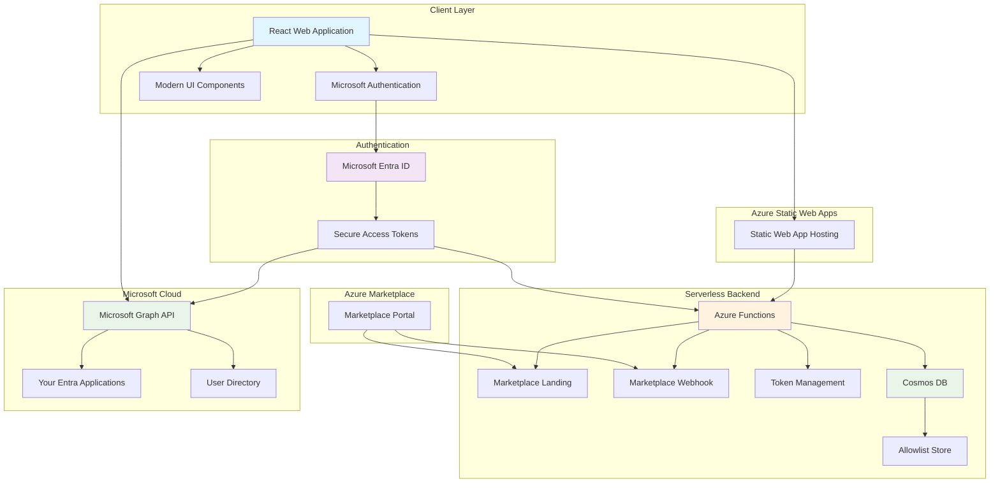

# AppConfig² Architecture Overview

This document provides a high-level overview of the AppConfig² Suite's technical architecture and design principles.

## 🏗️ High-Level Architecture

## 🎯 Core Design Principles

### 1. Security-First Architecture
- **Zero Trust** - Every request is authenticated and verified
- **No Secrets Storage** - Your credentials never leave Microsoft's secure environment
- **Delegated Permissions** - AppConfig² only accesses what you explicitly allow
- **Encrypted Communications** - All data is encrypted in transit

### 2. Microsoft-Native Integration
- **Native Entra ID Authentication** - Uses your existing Microsoft identity
- **Microsoft Graph API** - Direct integration using secure HTTP calls
- **Azure-Ready** - Designed for Azure-native deployment and scaling
- **Enterprise Compliance** - Meets Microsoft's enterprise security standards

### 3. Modern Web Technology
- **Single Page Application** - Fast, responsive user experience
- **Component-Based Architecture** - Modular, maintainable React components using Material UI
- **TypeScript Integration** - Type-safe development with enhanced code quality
- **Progressive Enhancement** - Features load based on your permissions
- **Azure Static Web Apps Hosting** - Secure, scalable, and globally distributed frontend hosting

## 🔐 Security Architecture

### Authentication Flow
1. **Sign In** - Authenticate with your Microsoft Entra ID account
2. **Permission Grant** - Explicitly grant permissions for specific operations
3. **Secure Access** - AppConfig² receives temporary, scoped access tokens
4. **Protected Operations** - All actions validated against your permissions
5. **Automatic Refresh** - Tokens automatically renewed for seamless experience

### Data Protection
- **🔒 Zero Data Storage** - No application data stored outside Microsoft's environment
- **🎫 Token-Based Access** - All operations use temporary, scoped access tokens
- **🛡️ Least Privilege** - Only minimum required permissions requested
- **📊 Audit Ready** - All operations logged for compliance and security

## 🏢 Enterprise-Ready Features

### Scalability
- **Multi-Tenant Support** - Works with any size organization
- **High Performance** - Optimized for organizations with hundreds of applications
- **Efficient Caching** - Smart data caching reduces API calls and improves speed
- **Bulk Operations** - Handle multiple applications efficiently

### Compliance & Governance
- **Azure Marketplace** - Enterprise-ready deployment and billing
- **SOC 2 Aligned** - Follows Microsoft's security and compliance standards

### Tool Differentiation
- **AppConfig** - Full management capabilities with automatic backup protection
- **AppTesting** - Read-only analysis for strict change control environments
- **Shared Security** - Both tools use identical security architecture
- **Flexible Deployment** - Choose tools based on organizational requirements

## 🌐 Technology Stack

### Core Technologies
| Component        | Technology                       | Purpose                                 |
|------------------|----------------------------------|-----------------------------------------|
| **Frontend**     | React 18+ with TypeScript        | Modern, type-safe user interface        |
| **Authentication** | Microsoft MSAL 2.0             | Secure Microsoft identity integration   |
| **API Integration** | Direct HTTP calls to MS Graph API | Secure, flexible Microsoft API connectivity |
| **UI Framework** | Material-UI                      | Consistent, accessible design system    |
| **Backend Functions** | Azure Functions (Node.js/TypeScript) | Serverless backend for client credentials flow and marketplace integration |
| **Hosting Platform** | Azure Static Web Apps          | Secure, scalable, globally distributed frontend hosting |

### Azure Marketplace Integration
AppConfig² includes comprehensive Azure Marketplace SaaS integration:

| Component | Purpose | Implementation |
|-----------|---------|----------------|
| **Marketplace Landing** | Subscription activation and token resolution | Azure Function with marketplace API integration |
| **Marketplace Webhook** | Handle subscription lifecycle events | Azure Function processing subscribe/unsubscribe/changePlan events |
| **Billing Integration** | Azure-native subscription management | Integrated with Azure subscription billing |
| **Token Management** | Client credentials flow for backend operations | Azure Functions handling authentication flows |

### Backend Functions Detail
- **`get-token`** - Authentication token management for client credentials flow
- **`marketplace-landing`** - Subscription activation from Azure Marketplace
- **`marketplace-webhook`** - Marketplace event processing (subscribe, unsubscribe, suspend)
- **Serverless Architecture** - Auto-scaling, pay-per-use, zero idle costs

### Microsoft Integration
- **Microsoft Entra ID** - Native identity and access management
- **Microsoft Graph API** - Secure, comprehensive Microsoft 365 integration via direct HTTP
- **Azure Deployment** - Cloud-native deployment and scaling
- **Microsoft Support** - Enterprise-grade Microsoft ecosystem support

## 🚀 Deployment Options

### Azure Marketplace
- **One-Click Deployment** - Deploy directly from Azure Marketplace
- **Azure-Native Billing** - Integrated with your Azure subscription
- **Enterprise Security** - Inherits Azure's enterprise security features
- **Microsoft Support** - Access to Microsoft's enterprise support ecosystem

### Development & Testing
- **Development Environment** - Safe testing environment separate from production
- **Staging Deployment** - Test configurations before production deployment
- **Backup & Recovery** - Automatic configuration backup and restore (AppConfig)
- **Change Management** - Built-in change tracking and audit capabilities

## 📊 Performance & Reliability

### Performance Features
- **Optimized Loading** - Components load on-demand for faster startup
- **Intelligent Caching** - Smart caching reduces Microsoft Graph API calls
- **Real-Time Updates** - Live data synchronization without page refreshes
- **Responsive Design** - Optimized for desktop and tablet devices

### Reliability & Availability
- **High Availability** - Built on Microsoft's highly available infrastructure
- **Automatic Recovery** - Graceful handling of temporary service interruptions
- **Error Handling** - User-friendly error messages and automatic retry logic

---

## 🎯 Why This Architecture Matters

### For IT Decision Makers
- **✅ Enterprise Security** - Meets the highest enterprise security standards
- **✅ Microsoft Native** - Seamless integration with existing Microsoft infrastructure
- **✅ Scalable & Reliable** - Designed to grow with your organization
- **✅ Compliance Ready** - Built-in audit and compliance capabilities

### For Development Teams
- **✅ Modern Technology** - Built with latest web technologies and best practices
- **✅ Developer Friendly** - Clean APIs and comprehensive documentation
- **✅ Secure by Design** - Security built into every layer of the application
- **✅ Microsoft Ecosystem** - Leverages familiar Microsoft development patterns

### For Security Teams
- **✅ Zero Trust Architecture** - Never trust, always verify approach
- **✅ Minimal Attack Surface** - No secrets storage or persistent data
- **✅ Comprehensive Auditing** - Complete audit trail for all operations
- **✅ Microsoft Standards** - Follows Microsoft's enterprise security guidelines

---

> 🏗️ **Architecture Philosophy**: AppConfig² is built as a secure, Microsoft-native application that enhances your existing Entra ID environment without introducing additional security risks or compliance complexity.

> 📋 **Enterprise Ready**: This architecture supports organizations from small teams to large enterprises with hundreds of applications and strict compliance requirements.