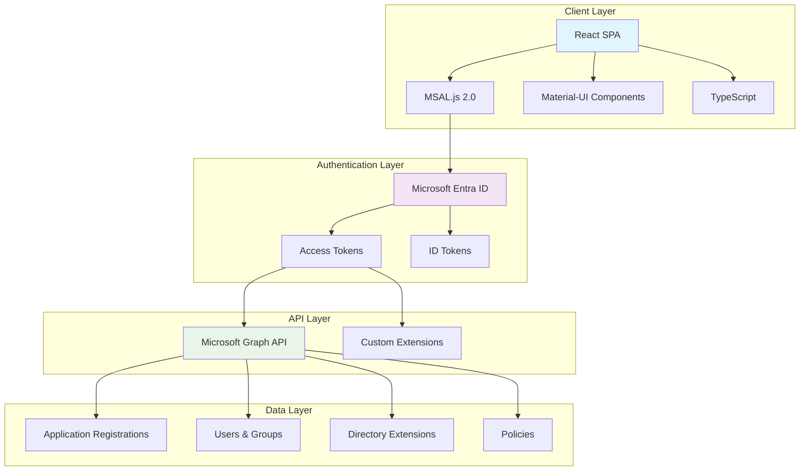

# AppConfig² Architecture Overview

This document provides a comprehensive overview of the technical architecture, design decisions, and implementation details of AppConfig².

## 🏗️ High-Level Architecture



## 🎯 Core Architecture Principles

### 1. Security-First Design
- **Zero Trust Architecture** - Never trust, always verify
- **Principle of Least Privilege** - Minimal required permissions only
- **Token-Based Authentication** - No stored credentials or secrets
- **Client-Side Security** - All sensitive operations server-validated

### 2. Scalability & Performance
- **Single Page Application** - Fast, responsive user experience
- **Lazy Loading** - Components loaded on-demand
- **Efficient Caching** - Smart caching strategies for Graph API data
- **Optimistic Updates** - UI updates before server confirmation

### 3. Maintainability
- **Component-Based Architecture** - Reusable, testable components
- **TypeScript** - Type safety and better developer experience
- **Consistent Patterns** - Standardized approaches across the application
- **Comprehensive Testing** - Unit, integration, and e2e testing

## 🔧 Technology Stack

### Frontend Technologies
| Technology | Version | Purpose |
|------------|---------|---------|
| React | 18+ | Core UI framework |
| TypeScript | 5.0+ | Type safety and developer experience |
| Material-UI (MUI) | 5.x | Component library and design system |
| MSAL.js | 2.x | Microsoft authentication library |
| React Router | 6.x | Client-side routing |
| Axios | 1.x | HTTP client for API calls |

### Development Tools
| Tool | Purpose |
|------|---------|
| Vite | Build tool and development server |
| ESLint | Code linting and style enforcement |
| Prettier | Code formatting |
| Jest | Unit testing framework |
| Cypress | End-to-end testing |
| Storybook | Component development and documentation |

## 🔐 Authentication Architecture

### MSAL Implementation
```typescript
// MSAL Configuration
const msalConfig = {
  auth: {
    clientId: process.env.REACT_APP_CLIENT_ID,
    authority: `https://login.microsoftonline.com/${tenantId}`,
    redirectUri: window.location.origin,
  },
  cache: {
    cacheLocation: "sessionStorage",
    storeAuthStateInCookie: false,
  },
};

// Required Scopes
const graphScopes = [
  "Application.ReadWrite.All",
  "Directory.ReadWrite.All",
  "Policy.ReadWrite.All",
  "User.ReadWrite.All"
];
```

### Token Management
- **Automatic Token Refresh** - Silent token renewal before expiration
- **Token Caching** - Efficient token storage and retrieval
- **Scope-Based Access** - Dynamic scope requests based on features
- **Error Handling** - Comprehensive error handling for authentication failures

## 📊 State Management

### React Context Pattern
```typescript
// Application State Context
interface AppContextType {
  applications: Application[];
  currentApp: Application | null;
  user: User | null;
  loading: boolean;
  error: string | null;
}

// Custom Hooks
const useApplications = () => {
  const context = useContext(AppContext);
  return {
    applications: context.applications,
    loading: context.loading,
    error: context.error,
    actions: {
      loadApplications,
      createApplication,
      updateApplication,
      deleteApplication,
    }
  };
};
```

### Data Flow
1. **Component Triggers Action** - User interaction triggers state change
2. **Context Updates** - Centralized state management through React Context
3. **Graph API Call** - Authenticated API call to Microsoft Graph
4. **State Update** - Context state updated with new data
5. **Component Re-render** - UI updates reflect new state

## 🌐 API Integration

### Microsoft Graph SDK Integration
```typescript
// Graph Client Configuration
const graphClient = Client.init({
  authProvider: async (done) => {
    try {
      const token = await instance.acquireTokenSilent({
        scopes: ["https://graph.microsoft.com/.default"],
        account: accounts[0],
      });
      done(null, token.accessToken);
    } catch (error) {
      done(error, null);
    }
  },
});

// Type-Safe API Calls
class ApplicationService {
  async getApplications(): Promise<Application[]> {
    const response = await graphClient
      .api('/applications')
      .select('id,appId,displayName,createdDateTime')
      .top(100)
      .get();
    
    return response.value;
  }
}
```

### Error Handling Strategy
- **Centralized Error Handling** - Consistent error processing across the application
- **User-Friendly Messages** - Technical errors translated to user-friendly messages
- **Retry Logic** - Automatic retry for transient failures
- **Fallback Mechanisms** - Graceful degradation when services are unavailable

## 🎨 Component Architecture

### Component Hierarchy
```
App
├── AuthenticationProvider
├── AppRouter
│   ├── DashboardLayout
│   │   ├── Sidebar
│   │   ├── TopBar
│   │   └── MainContent
│   │       ├── ApplicationList
│   │       ├── ApplicationDetail
│   │       └── ToolsSection
│   └── AuthenticationRequired
├── NotificationProvider
└── ThemeProvider
```

### Design System
- **Consistent Styling** - Material-UI theme customization
- **Responsive Design** - Mobile-first responsive layout
- **Accessibility** - WCAG 2.1 AA compliance
- **Dark Mode Support** - User preference-based theme switching

## 🔒 Security Implementation

### Client-Side Security
```typescript
// Permission Validation
const usePermissions = () => {
  const { user } = useAuth();
  
  const hasPermission = (permission: string): boolean => {
    return user?.permissions?.includes(permission) ?? false;
  };
  
  const requirePermission = (permission: string) => {
    if (!hasPermission(permission)) {
      throw new UnauthorizedError(`Missing permission: ${permission}`);
    }
  };
  
  return { hasPermission, requirePermission };
};

// Secure API Calls
const secureApiCall = async (operation: () => Promise<any>) => {
  try {
    return await operation();
  } catch (error) {
    if (error.code === 'TokenExpired') {
      await refreshToken();
      return await operation();
    }
    throw error;
  }
};
```

### Data Protection
- **No Sensitive Data Storage** - Credentials never stored client-side
- **Encrypted Transport** - All communications over HTTPS
- **Token Validation** - Server-side token validation for all operations
- **Audit Logging** - Comprehensive logging of all security-relevant events

## 📈 Performance Optimizations

### Code Splitting
```typescript
// Lazy Component Loading
const ApplicationDetail = lazy(() => import('./components/ApplicationDetail'));
const ToolsSection = lazy(() => import('./components/ToolsSection'));
const SecurityAnalyzer = lazy(() => import('./components/SecurityAnalyzer'));

// Route-Based Code Splitting
const AppRouter = () => (
  <Suspense fallback={<LoadingSpinner />}>
    <Routes>
      <Route path="/apps/:id" element={<ApplicationDetail />} />
      <Route path="/tools" element={<ToolsSection />} />
      <Route path="/security" element={<SecurityAnalyzer />} />
    </Routes>
  </Suspense>
);
```

### Caching Strategy
- **Memory Caching** - In-memory cache for frequently accessed data
- **HTTP Caching** - Proper cache headers for static resources
- **Graph API Caching** - Smart caching of Graph API responses
- **Cache Invalidation** - Automatic cache invalidation on data changes

## 🧪 Testing Strategy

### Testing Pyramid
```typescript
// Unit Tests - Component Testing
describe('ApplicationCard', () => {
  it('should display application information correctly', () => {
    const mockApp = createMockApplication();
    render(<ApplicationCard application={mockApp} />);
    
    expect(screen.getByText(mockApp.displayName)).toBeInTheDocument();
    expect(screen.getByText(mockApp.appId)).toBeInTheDocument();
  });
});

// Integration Tests - API Integration
describe('ApplicationService', () => {
  it('should fetch applications from Graph API', async () => {
    const mockGraphClient = createMockGraphClient();
    const service = new ApplicationService(mockGraphClient);
    
    const applications = await service.getApplications();
    
    expect(applications).toHaveLength(3);
    expect(mockGraphClient.api).toHaveBeenCalledWith('/applications');
  });
});

// E2E Tests - User Workflows
describe('Application Management', () => {
  it('should allow creating a new application', () => {
    cy.visit('/applications');
    cy.get('[data-testid="create-app-button"]').click();
    cy.get('[data-testid="app-name-input"]').type('Test Application');
    cy.get('[data-testid="submit-button"]').click();
    
    cy.contains('Test Application').should('be.visible');
  });
});
```

### Quality Assurance
- **Automated Testing** - Comprehensive test suite with CI/CD integration
- **Code Coverage** - Minimum 80% code coverage requirement
- **Performance Testing** - Regular performance benchmarking
- **Security Testing** - Automated security vulnerability scanning

## 🚀 Deployment Architecture

### Build Process
```yaml
# Build Pipeline
build:
  stage: build
  script:
    - npm ci
    - npm run type-check
    - npm run lint
    - npm run test:coverage
    - npm run build
  artifacts:
    paths:
      - dist/
    expire_in: 1 hour

# Security Scanning
security:
  stage: security
  script:
    - npm audit
    - npm run security:scan
    - npm run vulnerability:check
```

### Environment Configuration
- **Environment Variables** - Configuration through environment variables
- **Feature Flags** - Runtime feature toggling
- **A/B Testing** - Controlled feature rollouts
- **Monitoring Integration** - Application performance monitoring

## 📊 Monitoring & Observability

### Application Monitoring
```typescript
// Error Tracking
const errorHandler = (error: Error, errorInfo: ErrorInfo) => {
  console.error('Application Error:', error);
  
  // Send to monitoring service
  monitoringService.captureException(error, {
    extra: errorInfo,
    user: getCurrentUser(),
    timestamp: new Date().toISOString(),
  });
};

// Performance Monitoring
const performanceLogger = {
  trackApiCall: (endpoint: string, duration: number) => {
    monitoringService.addBreadcrumb({
      category: 'api',
      message: `${endpoint} completed in ${duration}ms`,
      level: 'info',
    });
  },
  
  trackUserAction: (action: string, metadata?: object) => {
    monitoringService.captureEvent(action, metadata);
  },
};
```

### Health Checks
- **Application Health** - Regular application health monitoring
- **Dependency Health** - Monitor Microsoft Graph API availability
- **Performance Metrics** - Track response times and error rates
- **User Experience** - Monitor real user performance data

## 🔮 Future Architecture Considerations

### Scalability Enhancements
- **Micro-Frontend Architecture** - Break application into independent micro-frontends
- **Worker Threads** - Offload heavy computations to web workers
- **Progressive Web App** - Add PWA capabilities for offline functionality
- **Edge Computing** - Leverage edge computing for improved performance

### Technology Evolution
- **React Server Components** - Adoption of React Server Components
- **WebAssembly** - High-performance computations with WebAssembly
- **GraphQL** - Potential migration to GraphQL for more efficient data fetching
- **AI Integration** - Machine learning-powered features and insights

---

> 📝 **Note**: This architecture is continuously evolving. For the latest technical specifications, please refer to the codebase documentation and technical design documents.
