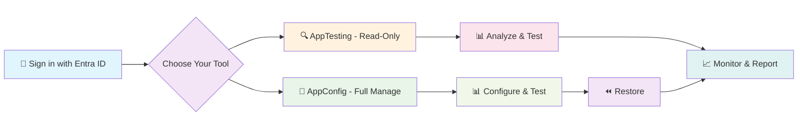

# AppConfig² Suite

  
  
<strong>Complete Identity and Access Management Suite for Microsoft Entra™</strong>

---

## 🚀 What is AppConfig² Suite?

AppConfig² is a comprehensive Identity and Access Management suite featuring two specialized tools designed for different organizational needs and compliance requirements. Both tools provide powerful Microsoft Entra ID (formerly Azure AD) capabilities while serving distinct use cases.

### 🔧 AppConfig - Full Configuration Management
The complete solution for developers, IT administrators, and security professionals who need full control over application configurations with comprehensive backup and restore capabilities.

### 🔍 AppTesting - Read-Only Analysis & Testing
A specialized tool for organizations requiring configuration changes through official Entra portal only, while maintaining powerful troubleshooting and analysis capabilities.

---

## 🎯 Who Is This Suite For?

<table>
<tr>
<td align="center" width="25%">

 <strong>Level 3 Support</strong>
 Comprehensive troubleshooting with both read-only and full management options
</td>
<td align="center" width="25%">

 <strong>Developers</strong>
 Test authentication flows with appropriate tool based on environment permissions
</td>
<td align="center" width="25%">

 <strong>IT Administrators</strong>
 Choose between full management or compliance-ready read-only analysis
</td>
<td align="center" width="25%">

 <strong>Security Engineers</strong>
 Security analysis tools with appropriate access levels for your organization
</td>
</tr>
</table>

---

## ⭐ Core Suite Features

### 🌟 Shared Capabilities (Both Tools)
- **🎫 Authentication Flow Testing** - Test various flows and inspect token responses
- **🔓 Advanced Token Analysis** - Decode and analyze OAuth/OIDC tokens with detailed claims
- **📊 Enhanced Dashboard** - Real-time application portfolio metrics and insights
- **🛡️ Security Analysis** - Comprehensive permission analysis and risk assessment
- **📈 Attack Surface Analysis** - Identify and evaluate potential security vulnerabilities
- **🔄 Application Lifecycle Tracking** - Monitor creation, ownership, and change history
- **🌐 Embedded Graph Explorer** - Deep dive analysis using Microsoft Graph API
- **📋 Conditional Access Analysis** - View applied policies and their authentication impact

### 🔧 AppConfig - Full Management Capabilities
- **📝 Complete App Lifecycle** - Create, configure, and manage applications end-to-end
- **🔄 Automatic Backups & Restore** - Tested application silently backed up with one-click restoration
- **👥 User Provisioning** - Provision and deprovision users with role assignments
- **🏷️ Dynamic App Roles** - Create and manage application roles with permissions
- **🗺️ Claims Mapping Policies** - Create, edit, and assign claims mapping policies
- **📦 Directory Extensions** - Manage custom directory extensions and attributes
- **🔑 Credential Management** - Generate and manage client secrets and certificates

### 🔍 AppTesting - Read-Only Analysis
- **✅ All Testing Capabilities** - Complete authentication flow testing without modifications
- **🛡️ Compliance Ready** - Meets strict organizational change control policies
- **📊 Comprehensive Analysis** - Full permission and security analysis capabilities
- **🔒 Safe Operation** - Zero risk of accidental configuration changes
- **👀 Deep Insights** - All troubleshooting features with read-only access

---

## 📸 Suite Screenshots

### Application Dashboard

### Application Filtering

### Application Management

📱 <strong>View More Screenshots</strong>

### Troubleshooting Authentication as Different User

### Advanced Tools Suite

### Integrated Graph Explorer

---

## 🚦 How The Suite Works

### AppConfig Workflow
1. **🔐 Sign in** with your Microsoft Entra ID account
2. **🎯 Select** applications from your portfolio dashboard
3. **🔧 Configure** settings with automatic backup protection
4. **📊 Test** authentication flows and analyze results
5. **⏪ Restore** configurations using one-click restoration

### AppTesting Workflow
1. **🔐 Sign in** with your Microsoft Entra ID account
2. **🎯 Select** applications for analysis
3. **📊 Test** authentication flows without modification risks
4. **🔍 Analyze** configurations and identify issues
5. **📈 Report** findings while maintaining compliance

---

## 🏁 Getting Started

### Choose Your Tool

**Need full configuration management?** → **AppConfig**
- Modify application settings
- Create and manage app roles
- Generate client secrets
- User provisioning capabilities
- Complete backup and restore

**Need read-only analysis only?** → **AppTesting**
- Comprehensive testing without changes
- Compliance with strict change control
- All troubleshooting capabilities
- Risk-free operation
- Security and permission analysis

### Quick Start
1. Get the AppConfig² Suite on Azure Marketplace: <a href="https://azuremarketplace.microsoft.com/en-us/marketplace/apps?search=AppConfig%C2%B2&page=1" target="_blank" rel="noopener noreferrer">Open Azure Marketplace</a>
2. Choose your tool based on organizational requirements
3. Sign in with your Entra ID credentials
4. Explore the enhanced dashboard and portfolio insights
5. Start testing with comprehensive toolkit

---

## 🏗️ Technical Architecture

The AppConfig² Suite is built using modern web technologies optimized for enterprise identity management:

- **Frontend**: React 18+ with TypeScript and Material-UI
- **Authentication**: Microsoft Authentication Library (MSAL) 2.0
- **API Integration**: Microsoft Graph SDK with enhanced caching
- **State Management**: React Context with custom hooks and optimized caching
- **Security**: OAuth 2.0 / OpenID Connect compliant with zero-trust architecture

### Enhanced Features
- **Portfolio Dashboard**: Real-time application metrics and insights
- **Advanced Caching**: Optimized performance with intelligent data caching
- **Export Capabilities**: CSV exports for security and lifecycle analysis
- **Attack Surface Analysis**: Comprehensive security vulnerability assessment
- **Lifecycle Tracking**: Complete application creation and change history

---

## 🔒 Security & Compliance

The AppConfig² Suite follows enterprise security best practices:

- **🔐 Zero Secrets Storage** - No application secrets or credentials stored
- **🎫 Token-Based Access** - All operations use delegated permissions
- **🛡️ Principle of Least Privilege** - Minimal required permissions only
- **🔄 Automatic Backups** - Safety nets for all modifications (AppConfig)
- **📊 Compliance Ready** - Read-only option for strict change control (AppTesting)
- **🛡️ Zero Trust Architecture** - Never trust, always verify approach

---

## 📚 Suite Documentation

- **[AppConfig² Features Guide](./Features%20Guide.md)** - Comprehensive suite feature documentation
- **[Architecture Overview](./Architecture%20Overview.md)** - Technical architecture and design decisions

---

## 🤝 Contributing

We welcome contributions from the community! Whether you're reporting bugs, suggesting features, or contributing code, please read our [Contributing Guidelines](./CONTRIBUTING.md).

### Ways to Contribute
- 🐛 **Report Issues** - Help us identify and fix bugs across both tools
- 💡 **Suggest Features** - Share ideas for new functionality in either tool
- 📖 **Improve Documentation** - Help make our comprehensive docs better
- 🧪 **Beta Testing** - Join our early access program for the complete suite

---

## 🛒 Azure Marketplace Availability

Now available on Azure Marketplace:
- 1-month free trial of the full AppConfig² Suite
- Azure-native billing and subscription management
- Enterprise-ready security and compliance
- Professional technical support

Get it on Azure Marketplace:
<a href="https://azuremarketplace.microsoft.com/en-us/marketplace/apps?search=AppConfig%C2%B2&page=1" target="_blank" rel="noopener noreferrer">Open Azure Marketplace</a>

---

## 📞 Support & Community

- **🌐 Website**: [www.configsquared.com](https://www.configsquared.com/)
- **💼 LinkedIn**: [AppConfig² Company Page](https://www.linkedin.com/company/appconfig-square/)
- **📧 Email**: [support@AppConfig.app](mailto:support@AppConfig.app)

---

## 📄 License

This project is proprietary software. All rights reserved. See [LICENSE](./LICENSE.md) for details.

---

## 🙏 Acknowledgments

- **Microsoft** for the comprehensive Entra ID and Graph API ecosystem
- **Early Access Users** for valuable feedback and testing across both tools
- **Enterprise Partners** for guidance on compliance and organizational requirements

---

  <h3>🚀 Get it on Azure Marketplace</h3>
  
Deploy AppConfig² Suite with Azure-native billing and compliance.

  

---

  Built with ❤️ for the Microsoft Entra ID community

