# AppConfig² 

  
  
  <h3>Empowering Microsoft Entra™ App Management</h3>
  
  
  
  
  
  
<strong>The ultimate tool for testing, configuring, and troubleshooting Microsoft Entra™ applications with confidence and ease.</strong>

---

## 🚀 What is AppConfig²?

AppConfig² is a specialized web application designed for developers, IT administrators, and security professionals who work with Microsoft Entra ID (formerly Azure AD). It provides a comprehensive suite of tools to safely test authentication flows, configure applications, decode tokens, and perform in-depth analysis of app registrations.

### ✨ Key Highlights

- **🔐 Safe Testing Environment** - Test app configurations without fear of breaking production
- **🔄 Automatic Backups** - Every change is backed up automatically for easy restoration
- **🎯 Real-time Token Analysis** - Decode and inspect OAuth/OIDC tokens instantly
- **📊 Embedded Graph Explorer** - Deep dive into your app's configuration using Microsoft Graph
- **🛡️ Security-First Design** - Built with enterprise security best practices

---

## 🎯 Who Is This For?

<table>
<tr>
<td align="center" width="25%">

 <strong>Level 3 Support</strong>
 Troubleshoot complex application issues with a single comprehensive tool
</td>
<td align="center" width="25%">

 <strong>Developers</strong>
 Quickly test authentication flows and ensure seamless Entra ID integration
</td>
<td align="center" width="25%">

 <strong>IT Administrators</strong>
 Efficiently test and configure app registrations in hybrid/cloud environments
</td>
<td align="center" width="25%">

 <strong>Security Engineers</strong>
 Verify app configurations against security best practices
</td>
</tr>
</table>

---

## ⭐ Core Features

### 🔧 Application Management
- **📝 Register New Applications** - Create and configure app registrations with guided workflows
- **🔄 Redirect URI Management** - Add/remove redirect URIs for troubleshooting authorization issues
- **👥 User Provisioning** - Easily provision or deprovision users to applications
- **🏷️ App Roles Management** - Define and manage application roles dynamically
- **🔑 API Permissions** - Use intuitive Graph picker to configure required permissions

### 🔍 Testing & Analysis
- **🎫 Token Authentication** - Test various authentication flows and inspect token responses
- **🔓 Token Decoder** - Decode and analyze OAuth/OIDC tokens with detailed claims view
- **📋 Claims Management** - Add custom claims to tokens for testing requirements
- **🛡️ Security Analyzer** - Analyze application permissions and identify security risks
- **📊 Permission Analyzer** - Comprehensive analysis of application permissions and risks

### 🛠️ Advanced Tools
- **🌐 Embedded Graph Explorer** - Integrated Microsoft Graph API explorer for deep analysis
- **🗺️ Claims Mapping Policies** - Create, edit, and assign claims mapping policies
- **📄 Manifest Editor** - Direct application manifest editing when needed
- **📦 Directory Extensions** - Create and manage custom directory extensions
- **📋 Conditional Access Analysis** - View applied conditional access policies

### 🔄 Safety & Backup
- **💾 Automatic Backups** - Every configuration change is automatically backed up
- **⏪ Easy Restoration** - Restore applications to previous configurations with one click
- **🔒 Safe Testing** - Test configurations without impacting production environments

---

## 📸 Screenshots

### Dashboard Home View

### Application Testing Interface

### Authentication Flow Testing

📱 <strong>View More Screenshots</strong>

### Application Filtering

### Advanced Tools

### Security Analyzer

### Graph Explorer Integration

---

## 🚦 How It Works

```mermaid
graph LR
    A[🔐 Sign in with Entra ID] --> B[🎯 Select Application]
    B --> C[🔧 Test Configurations]
    C --> D[📊 Analyze Results]
    D --> E[⏪ Restore if Needed]
    
    style A fill:#e1f5fe
    style B fill:#f3e5f5
    style C fill:#e8f5e8
    style D fill:#fff3e0
    style E fill:#fce4ec
```

1. **🔐 Sign in** with your Microsoft Entra ID account
2. **🎯 Select** the application you want to test or configure
3. **🔧 Test** different configurations, add claims, modify settings
4. **📊 Analyze** authentication flows, tokens, and security settings
5. **⏪ Restore** original configuration using automatic backups

---

## 🏁 Getting Started

### Prerequisites
- Microsoft Entra ID tenant access
- Application registration permissions
- Modern web browser (Chrome, Firefox, Edge, Safari)

### Quick Start
1. **Request Early Access** at [AppConfig² Website](https://appconfigapp.toncheetah.com/)
2. **Sign in** with your Entra ID credentials
3. **Explore** the dashboard and available applications
4. **Start testing** with the comprehensive toolkit

### Early Access Program 🎉
AppConfig² is currently in **Early Access**. Join our program to:
- ✅ Get full access to all premium features
- ✅ Receive priority support and direct feedback channel
- ✅ Influence future product development
- ✅ Earn exclusive lifetime discounts

[**Request Early Access →**](https://forms.office.com/Pages/ResponsePage.aspx?id=KpDK7BEFckufqeOwyvweCVTykKo0P21GpY7N2jlgh7xUNFExRVRDSVoxTlMxNVM3V0dFUkUyTDQ5UC4u)

---

## 🏗️ Technical Architecture

AppConfig² is built using modern web technologies optimized for enterprise identity management:

- **Frontend**: React 18+ with TypeScript and Material-UI
- **Authentication**: Microsoft Authentication Library (MSAL) 2.0
- **API Integration**: Microsoft Graph SDK
- **State Management**: React Context with custom hooks
- **Security**: OAuth 2.0 / OpenID Connect compliant

See [ARCHITECTURE.md](./ARCHITECTURE.md) for detailed technical documentation.

---

## 🔒 Security & Compliance

AppConfig² follows enterprise security best practices:

- **🔐 Zero Secrets Storage** - No application secrets or credentials stored
- **🎫 Token-Based Access** - All operations use delegated permissions
- **🛡️ Principle of Least Privilege** - Minimal required permissions only
- **📋 Audit Trail** - Comprehensive logging of all configuration changes
- **🔄 Automatic Backups** - Safety nets for all modifications

Read our [SECURITY.md](./SECURITY.md) for complete security documentation.

---

## 📚 Documentation

- **[Features Guide](./FEATURES.md)** - Comprehensive feature documentation
- **[Architecture Overview](./ARCHITECTURE.md)** - Technical architecture details
- **[Security Guidelines](./SECURITY.md)** - Security considerations and best practices
- **[Contributing Guide](./CONTRIBUTING.md)** - How to contribute to the project

---

## 🤝 Contributing

We welcome contributions from the community! Whether you're reporting bugs, suggesting features, or contributing code, please read our [Contributing Guidelines](./CONTRIBUTING.md).

### Ways to Contribute
- 🐛 **Report Issues** - Help us identify and fix bugs
- 💡 **Suggest Features** - Share ideas for new functionality
- 📖 **Improve Documentation** - Help make our docs better
- 🧪 **Beta Testing** - Join our early access program

---

## 📞 Support & Community

- **🌐 Website**: [appconfigapp.toncheetah.com](https://appconfigapp.toncheetah.com/)
- **💼 LinkedIn**: [AppConfig² Company Page](https://www.linkedin.com/company/appconfig-square/)
- **📧 Email**: [support@AppConfig.app](mailto:support@AppConfig.app)
- **📋 Early Access**: [Request Access Form](https://forms.office.com/Pages/ResponsePage.aspx?id=KpDK7BEFckufqeOwyvweCVTykKo0P21GpY7N2jlgh7xUNFExRVRDSVoxTlMxNVM3V0dFUkUyTDQ5UC4u)

---

## 📄 License

This project is proprietary software. All rights reserved. See [LICENSE](./LICENSE) for details.

---

## 🙏 Acknowledgments

- **Microsoft** for the comprehensive Entra ID and Graph API ecosystem
- **Themefisher** for the website design foundation
- **Early Access Users** for valuable feedback and testing

---

  <h3>🚀 Ready to Transform Your Entra ID Management?</h3>
  
Join thousands of professionals who trust AppConfig² for their identity management needs.

  
  

---

  Built with ❤️ for the Microsoft Entra ID community

