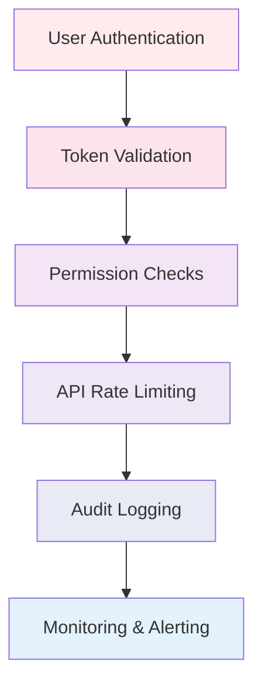

# Security Guidelines for AppConfig²

AppConfig² is built with enterprise-grade security as a fundamental principle. This document outlines our security approach, compliance measures, and best practices.

## 🛡️ Security Architecture

### Zero Trust Security Model
AppConfig² implements a comprehensive Zero Trust architecture:

- **Never Trust, Always Verify** - Every request is authenticated and authorized
- **Principle of Least Privilege** - Minimal required permissions only
- **Continuous Verification** - Ongoing validation of user identity and device trust
- **Encrypted Everywhere** - End-to-end encryption for all data in transit

### Defense in Depth
Multiple layers of security controls protect the application:



## 🔐 Authentication & Authorization

### Microsoft Entra ID Integration
- **Native Integration** - Direct integration with Microsoft Entra ID
- **Conditional Access Support** - Full compliance with conditional access policies
- **Multi-Factor Authentication** - MFA enforcement for enhanced security
- **Single Sign-On** - Seamless SSO experience across Microsoft ecosystem

### Permission Model
- **Delegated Permissions** - All operations performed on behalf of signed-in user
- **Just-In-Time Access** - Permissions requested only when needed
- **Scope-Based Authorization** - Granular permission scoping for different features
- **Admin Consent Management** - Proper handling of admin consent requirements

## 🔒 Data Protection

### Data Classification
| Data Type | Classification | Protection Level |
|-----------|---------------|------------------|
| User Credentials | Highly Sensitive | Never stored client-side |
| Access Tokens | Sensitive | Memory only, auto-expired |
| Application Config | Internal | Encrypted in transit |
| Audit Logs | Internal | Tamper-proof logging |
| User Data | Sensitive | Encrypted, access controlled |

### Encryption Standards
- **TLS 1.3** - All communications encrypted with TLS 1.3
- **AES-256** - Industry-standard encryption for data at rest
- **Certificate Pinning** - Protection against man-in-the-middle attacks
- **Perfect Forward Secrecy** - Session keys cannot be compromised retroactively

## 🚨 Threat Protection

### Common Attack Vectors & Mitigations

#### Cross-Site Scripting (XSS)
- **Content Security Policy** - Strict CSP headers prevent script injection
- **Input Sanitization** - All user inputs properly sanitized
- **React Built-in Protection** - React's built-in XSS protection mechanisms
- **Trusted Types** - Implementation of Trusted Types API

#### Cross-Site Request Forgery (CSRF)
- **SameSite Cookies** - CSRF protection through SameSite cookie attributes
- **Token Validation** - CSRF tokens for state-changing operations
- **Origin Validation** - Strict origin and referrer checking

#### Injection Attacks
- **Parameterized Queries** - No dynamic query construction
- **Input Validation** - Comprehensive input validation and type checking
- **Graph API Protection** - Microsoft Graph API provides built-in injection protection

#### Session Management
- **Secure Session Handling** - Proper session lifecycle management
- **Session Timeout** - Automatic session expiration
- **Concurrent Session Control** - Detection and handling of concurrent sessions

## 🔍 Security Monitoring

### Audit Logging
- **Comprehensive Logging** - All security-relevant events logged
- **Tamper-Proof Logs** - Cryptographically signed audit logs
- **Real-Time Alerting** - Immediate alerts for security incidents
- **Log Retention** - Secure log retention and archival policies

### Security Metrics
| Metric | Threshold | Action |
|--------|-----------|--------|
| Failed login attempts | 5 per user per hour | Account lockout |
| Suspicious API calls | 10 per minute | Rate limiting |
| Privilege escalation | Any attempt | Immediate alert |
| Data exfiltration | Unusual patterns | Investigation trigger |

## 🏛️ Compliance & Standards

### Industry Compliance
- **SOC 2 Type II** - Service Organization Control compliance
- **ISO 27001** - Information security management standards
- **GDPR** - General Data Protection Regulation compliance
- **CCPA** - California Consumer Privacy Act compliance

### Microsoft Security Standards
- **Microsoft SDL** - Security Development Lifecycle compliance
- **Azure Security Baseline** - Adherence to Azure security recommendations
- **Microsoft Cloud Security** - Integration with Microsoft cloud security services
- **Entra ID Best Practices** - Following Microsoft Entra ID security guidelines

### Data Residency
- **Regional Data Storage** - Data stored according to regional requirements
- **Cross-Border Transfer** - Compliant international data transfer mechanisms
- **Data Sovereignty** - Respect for national data sovereignty laws
- **Encryption in Transit** - All cross-border data transfers encrypted

## 🔧 Security Configuration

### Recommended Security Settings
```json
{
  "authentication": {
    "requireMFA": true,
    "sessionTimeout": 480,
    "maxFailedAttempts": 5,
    "passwordPolicy": "strong"
  },
  "authorization": {
    "requireAdminConsent": true,
    "principleOfLeastPrivilege": true,
    "regularAccessReview": true
  },
  "monitoring": {
    "auditLogging": true,
    "realTimeAlerts": true,
    "securityScanning": true
  }
}
```

### Conditional Access Policies
Recommended conditional access policies for AppConfig²:

1. **Require MFA** - Multi-factor authentication for all users
2. **Device Compliance** - Require compliant or Hybrid Azure AD joined devices
3. **Location-Based Access** - Restrict access based on named locations
4. **Risk-Based Policies** - Block or require additional verification for risky sign-ins

## 🚨 Incident Response

### Security Incident Classification
| Severity | Description | Response Time |
|----------|-------------|---------------|
| Critical | Active security breach | Immediate (< 1 hour) |
| High | Potential security threat | 4 hours |
| Medium | Security policy violation | 24 hours |
| Low | Security awareness issue | 72 hours |

### Incident Response Process
1. **Detection & Analysis** - Identify and analyze security incidents
2. **Containment** - Immediate containment of security threats
3. **Eradication** - Remove threats and vulnerabilities
4. **Recovery** - Restore normal operations securely
5. **Lessons Learned** - Post-incident analysis and improvement

### Contact Information
- **Security Team**: [security@AppConfig.app](mailto:security@AppConfig.app)
- **Emergency Hotline**: Available through Microsoft Support
- **Incident Portal**: Secure incident reporting portal

## 🔐 User Security Guidelines

### Administrator Best Practices
- **Regular Access Reviews** - Quarterly review of user access and permissions
- **Principle of Least Privilege** - Grant minimum necessary permissions
- **Security Training** - Regular security awareness training for users
- **Backup & Recovery** - Regular testing of backup and recovery procedures

### End User Security
- **Strong Authentication** - Use of strong, unique passwords and MFA
- **Device Security** - Keep devices updated and use endpoint protection
- **Phishing Awareness** - Training on identifying and reporting phishing attempts
- **Safe Browsing** - Use of secure, up-to-date browsers

### Development Security
- **Secure Coding** - Follow secure coding practices and guidelines
- **Code Review** - Mandatory security-focused code reviews
- **Dependency Management** - Regular scanning and updating of dependencies
- **Static Analysis** - Automated static code analysis for security vulnerabilities

## 📋 Security Assessments

### Regular Security Testing
- **Penetration Testing** - Annual third-party penetration testing
- **Vulnerability Scanning** - Continuous automated vulnerability scanning
- **Code Security Analysis** - Static and dynamic application security testing
- **Security Architecture Review** - Regular review of security architecture

### Security Certifications
- **Microsoft Cloud Security** - Certified Microsoft cloud security implementation
- **Industry Certifications** - Team holds relevant security certifications
- **Continuous Learning** - Ongoing security education and certification maintenance

## 🔄 Security Updates

### Patch Management
- **Automated Updates** - Automated security patch deployment
- **Emergency Patches** - Rapid deployment process for critical security updates
- **Testing Process** - Comprehensive testing of security patches before deployment
- **Rollback Procedures** - Quick rollback capabilities for problematic updates


## 📞 Security Support

### Getting Security Help
- **Documentation**: Comprehensive security documentation available
- **Support Channels**: Multiple channels for security-related inquiries
- **Training Resources**: Security training materials and best practices guides
- **Community**: Active security community for knowledge sharing

### Reporting Security Issues
If you discover a security vulnerability, please report it responsibly:

1. **Email**: [security@AppConfig.app](mailto:security@AppConfig.app)
2. **Subject**: "Security Vulnerability Report"
3. **Include**: Detailed description, steps to reproduce, and impact assessment
4. **Response**: We commit to responding within 24 hours

### Security Bug Bounty
We operate a security bug bounty program to encourage responsible disclosure:
- **Scope**: All AppConfig² components and infrastructure
- **Rewards**: Monetary rewards based on severity and impact
- **Recognition**: Public recognition for security researchers (with permission)

---

> 🔒 **Security is Everyone's Responsibility**: Security is not just a technical concern but a shared responsibility across all users, administrators, and stakeholders. Stay vigilant, report suspicious activities, and follow security best practices.

For the latest security updates and advisories, visit our [Security Portal](https://appconfigapp.toncheetah.com/security) or subscribe to our security notifications.
